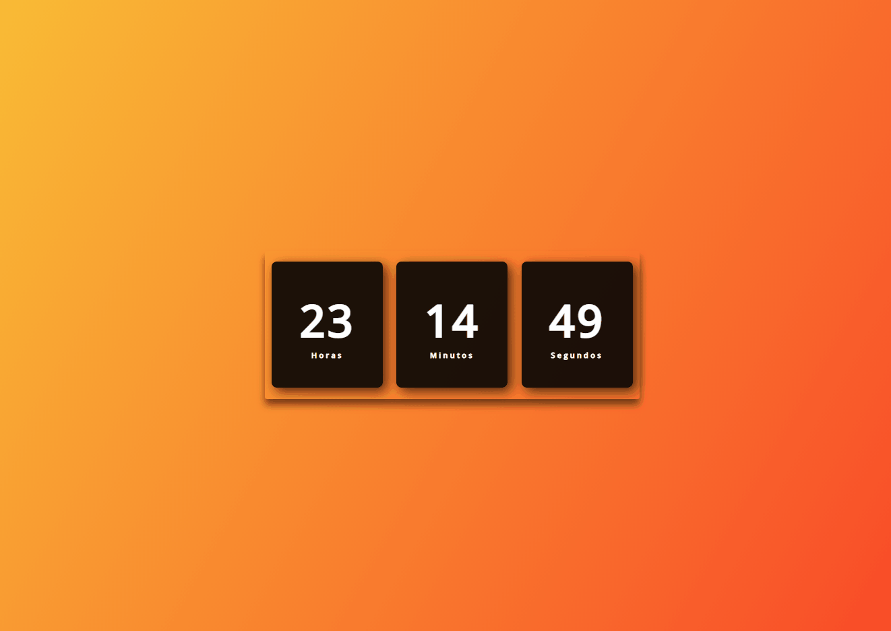

<h1 align="center">Relógio Digital</h1>

# Sobre o Projeto

Neste projeto desenvolvi um rélogio Digital, o objetivo deste projeto é fazer a hora, minutos e segundos passar em tempo real.

## Tecnologias usadas 🚀

- HTML
- CSS
- Javascript
